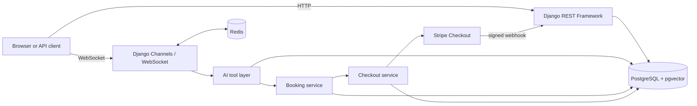

# Airport API

[](https://github.com/HalasOleh/airport-api/actions/workflows/ci.yml)

Airport API is a Django REST Framework application for managing airports,
flights, aircraft, seats, bookings, and payments. It also includes an
authenticated WebSocket assistant that can search live project data, reserve
seats, and create secure Stripe Checkout links through OpenAI or Gemini.

The project provides one backend for operational airport data, authenticated
self-service booking, and conversational access while keeping authorization,
pricing, seat availability, and payment state under server control.

## Features

- Airport, city, country, airline, aircraft, flight, and seat management.
- User registration and JWT authentication using secure HTTP-only cookies.
- User-scoped orders and tickets with server-side fare calculation.
- Transactional seat reservation with database locking and duplicate-seat
  protection.
- Hosted Stripe Checkout and signature-verified Stripe webhooks.
- Real-time AI chat over Django Channels and WebSockets.
- OpenAI and Gemini tool calling against live application data.
- Semantic knowledge-base search using pgvector and multilingual embeddings.
- Redis-backed Channels layer and chat-context cache.
- OpenAPI schema, Swagger UI, and ReDoc.
- Automated tests, data validation, CI, and optional Render deployment.

## Architecture



The AI layer is an adapter, not a source of truth. Flight availability, fares,
seat ownership, order state, and payment state are always checked by the
server against PostgreSQL.

## Technology stack

| Area | Technology |
| --- | --- |
| Backend | Python 3.13, Django, Django REST Framework |
| Async server | Daphne, Django Channels |
| Database | PostgreSQL 17 with pgvector |
| Cache and messaging | Redis, channels-redis |
| Authentication | SimpleJWT, HTTP-only cookies, CSRF protection |
| AI providers | OpenAI, Google Gemini |
| Retrieval | sentence-transformers, pgvector HNSW index |
| Payments | Stripe hosted Checkout and webhooks |
| API documentation | drf-spectacular, Swagger UI, ReDoc |
| Testing | pytest, pytest-django, pytest-asyncio |
| Delivery | Docker Compose, GitHub Actions, Render deploy hook |

## Quick start with Docker

### Prerequisites

- Git
- Docker Desktop or Docker Engine with Compose
- An OpenAI or Gemini API key if you want to use the assistant
- Stripe test credentials if you want to test payments

### 1. Clone the repository

```bash
git clone https://github.com/HalasOleh/airport-api.git
cd airport-api
```

### 2. Create the environment file

On Windows PowerShell:

```powershell
Copy-Item .env-example .env
```

On macOS or Linux:

```bash
cp .env-example .env
```

Replace the placeholder values in `.env`. At minimum, configure `SECRET_KEY`
and the PostgreSQL variables. Configure an AI provider key for chat and Stripe
keys for Checkout.

Never commit `.env` or real API keys.

### 3. Build and start the application

```bash
docker compose up --build
```

The web container waits for PostgreSQL and Redis, applies migrations, refreshes
the knowledge-base index, and starts Daphne on port `8000`.

The first image build can take several minutes because it installs the CPU-only
PyTorch package and downloads the embedding model.

### 4. Create an administrator

```bash
docker compose exec web python manage.py createsuperuser
```

### 5. Open the application

| Resource | URL |
| --- | --- |
| Swagger UI | <http://localhost:8000/api/schema/swagger-ui/> |
| ReDoc | <http://localhost:8000/api/schema/redoc/> |
| OpenAPI schema | <http://localhost:8000/api/schema/> |
| Django admin | <http://localhost:8000/admin/> |
| WebSocket test client | <http://localhost:8000/ws-page/> |

## Configuration

### Core application

| Variable | Purpose | Development default |
| --- | --- | --- |
| `SECRET_KEY` | Django cryptographic secret | Required |
| `DEBUG` | Django debug mode | `True` |
| `ALLOWED_HOSTS` | Comma-separated HTTP and WebSocket hosts | Local hosts |
| `DB_NAME` | PostgreSQL database | From `.env` |
| `DB_USER` | PostgreSQL user | From `.env` |
| `DB_PASSWORD` | PostgreSQL password | From `.env` |
| `DB_HOST` | PostgreSQL host | `db` in Docker |
| `DB_PORT` | PostgreSQL port | `5432` in Docker |
| `REDIS_URL` | Channels and chat-cache connection | `redis://redis:6379/0` |
| `BASE_URL` | Public origin used in payment return URLs | `http://localhost:8000` |
| `CHAT_CONTEXT_CACHE_TIMEOUT` | Chat cache lifetime in seconds | `3600` |

### AI and retrieval

| Variable | Purpose | Default |
| --- | --- | --- |
| `OPENAI_API_KEY` | Enables the OpenAI chat provider | None |
| `OPENAI_MODEL` | OpenAI model used by the consumer | `gpt-5.4-nano` |
| `GEMINI_API_KEY` | Enables the Gemini chat provider | None |
| `GEMINI_MODEL` | Gemini model used by the consumer | `gemini-3.6-flash` |
| `EMBEDDING_MODEL_NAME` | Knowledge-base embedding model | `intfloat/multilingual-e5-small` |

### Payments and external services

| Variable | Purpose |
| --- | --- |
| `STRIPE_SECRET_KEY` | Server-side Stripe test or live key |
| `STRIPE_WEBHOOK_SECRET` | Stripe webhook signing secret |
| `WEATHER_API_KEY` | Weather provider API key |
| `WEATHER_CITY` | Default weather city |
| `WEATHER_AQI` | Include air-quality data (`yes` or `no`) |
| `EMAIL_HOST` | SMTP server |
| `EMAIL_PORT` | SMTP port |
| `EMAIL_HOST_USER` | SMTP username and sender address |
| `EMAIL_HOST_PASSWORD` | SMTP password or application password |

For production, set `DEBUG=False`, use HTTPS, configure the real public
`BASE_URL`, restrict `ALLOWED_HOSTS`, and store all secrets in the deployment
platform rather than in a committed file.

## Authentication

Browser authentication uses short-lived JWTs stored in HTTP-only cookies:

- JavaScript cannot read the tokens.
- Unsafe cookie-authenticated HTTP requests require a CSRF token.
- WebSocket handshakes read the access token from the cookie.
- WebSocket origins are checked against `ALLOWED_HOSTS`.
- Non-browser clients may use the standard `Authorization: Bearer <token>`
  header and the `/api/user/token/` endpoint.

Main authentication routes:

| Method | Endpoint | Description |
| --- | --- | --- |
| `POST` | `/api/user/register/` | Create an account |
| `POST` | `/api/user/login/` | Log in and set JWT cookies |
| `POST` | `/api/user/login/refresh/` | Rotate the access token |
| `POST` | `/api/user/logout/` | Clear authentication cookies |
| `GET/PATCH` | `/api/user/me/` | Read or update the current user |
| `POST` | `/api/user/token/` | Obtain JWTs for a non-browser client |

## REST API overview

The complete, current contract is available in Swagger UI. The main route
groups are:

| Prefix | Resource |
| --- | --- |
| `/country/` | Countries |
| `/city/` | Cities |
| `/airport/` | Airports |
| `/airline/` | Airlines |
| `/airplane/` | Aircraft and seat configuration |
| `/flight/` | Flights, schedules, fares, and assigned aircraft |
| `/seat-type/` | Seat-class layouts |
| `/seat/` | Individual seats |
| `/tickets/order/` | Current user's orders |
| `/tickets/ticket/` | Current user's tickets |
| `/tickets/checkout/` | Create Checkout for an existing pending order |
| `/api/chat/dialogs/` | Current user's chat dialogs |
| `/api/chat/messages/` | Read-only chat history |

Authenticated regular users can read airport reference data. Administrative
writes require an administrator role. Orders, tickets, and chat records are
always scoped to the authenticated user.

## WebSocket assistant

### Connection flow

1. Log in through `/api/user/login/`.
2. Create a dialog with `POST /api/chat/dialogs/`.
3. Connect to `ws://localhost:8000/ws/chat/<dialog_id>/`.
4. Select a provider:

```json
{"provider": "openai"}
```

or:

```json
{"provider": "gemini"}
```

5. Send a message:

```json
{"message": "Find a flight from Kyiv to Lviv tomorrow"}
```

A normal response contains `reply`. When a confirmed booking produces a Stripe
session, the server also returns the exact Checkout URL as structured data:

```json
{
  "reply": "Your seats are reserved. Complete payment using the button below.",
  "checkout_url": "https://checkout.stripe.com/..."
}
```

The development client at `/ws-page/` renders that URL as a separate secure
Checkout button instead of relying on the language model to reproduce it.

### Available AI tools

- `search_flights`
- `get_flight_seats`
- `get_my_bookings`
- `create_checkout_link`
- `lookup_reference`
- `get_contacts`
- `get_weather`
- `search_knowledge_base`

The authenticated user is injected by the WebSocket consumer. It is never an
argument that the model can choose, which prevents requests for another user's
bookings.

## Booking and payment flow

```text
Search flight
  -> inspect available seats and server-calculated fares
  -> receive explicit user confirmation
  -> reserve seats in a database transaction
  -> create Stripe Checkout Session
  -> enter card details only on Stripe
  -> verify Stripe webhook signature
  -> mark Payment and Order as completed
```

Important safeguards:

- The assistant's booking service rejects past, cancelled, departed, boarding,
  and unsellable flights.
- Seat numbers are resolved against the aircraft assigned to the flight.
- Prices are calculated on the server and stored in cents.
- Flight-row locking and database constraints protect against concurrent sales.
- In the assistant booking flow, a failed Checkout creation cancels the pending
  order and releases its seats.
- The assistant never asks for card numbers, expiration dates, or CVV/CVC.
- Likely card numbers are rejected before reaching chat history, Redis, or an
  AI provider.
- Stripe webhook signatures are verified before payment state is changed.

Configure the production Stripe webhook to send events to:

```text
https://your-domain.example/api/payments/webhook/
```

The application currently handles `checkout.session.completed` and
`checkout.session.expired`.

## Knowledge base

Text sources in `ai_bot/knowledge_base/` are split into chunks, embedded, and
stored in PostgreSQL using pgvector. An HNSW index supports cosine-similarity
retrieval.

Rebuild changed sources:

```bash
docker compose exec web python manage.py reindex_kb
```

Force a complete rebuild:

```bash
docker compose exec web python manage.py reindex_kb --force
```

## Tests and quality checks

Run the complete suite:

```bash
docker compose exec -T web python -m pytest
```

Run Django's system checks:

```bash
docker compose exec -T web python manage.py check
```

Check that model changes have migrations:

```bash
docker compose exec -T web python manage.py makemigrations --check --dry-run
```

Validate existing database rows against model rules:

```bash
docker compose exec -T web python manage.py validate_data --fail
```

## CI/CD

The GitHub Actions workflow runs for every pull request and every push to
`main`. It starts isolated PostgreSQL/pgvector and Redis services, then runs:

1. Django deployment checks.
2. Missing-migration detection.
3. The complete pytest suite.
4. Migrations and reference-data validation.

After a successful push to `main`, the deploy job calls the Render deploy hook
stored in the `RENDER_DEPLOY_HOOK_URL` GitHub Actions secret. Pull requests are
not merged automatically.

## Project structure

```text
AirportProject/
├── airports/                 Airport, airline, aircraft, flight, and seat domain
├── tickets/                  Orders, tickets, payments, and domain services
│   └── services/
│       ├── booking.py        Transactional seat reservation
│       ├── checkout.py       Stripe Checkout session creation
│       └── smtp.py           Payment confirmation email
├── user/                     Custom user model and JWT authentication
├── ai_bot/                   WebSocket assistant, tools, prompts, and RAG
│   ├── knowledge_base/       Source documents for semantic search
│   ├── prompts/              System prompt configuration
│   ├── rag/                  Indexing, embeddings, and retrieval
│   └── tools/                Model-callable application adapters
├── config/                   Django settings, ASGI, URLs, and permissions
├── tests/                    Unit, integration, security, and WebSocket tests
├── docs/                     Specifications and implementation plans
├── .github/workflows/ci.yml  CI and Render deployment trigger
└── docker-compose.yml        Web, PostgreSQL/pgvector, and Redis services
```

The database relationship diagram is available in
[`airport_models_diagram.md`](airport_models_diagram.md).

## Contributing

Contributions should preserve the project's security and data-ownership rules.

1. Create a branch from `main`.
2. Keep each pull request focused on one change.
3. Add or update tests for changed behaviour.
4. Run the complete test suite and Django checks locally.
5. Document new environment variables, routes, tools, and migrations.
6. Open a pull request and wait for CI to pass before merging.

Do not commit generated caches, local databases, `.env` files, API keys, Stripe
credentials, access tokens, or payment-card data.

When changing booking or payment code, test both the successful path and the
failure path that must release or preserve seats correctly.

## Support

Use [GitHub Issues](https://github.com/HalasOleh/airport-api/issues) for bug
reports and feature requests. A useful report includes:

- a short description of the expected and actual behaviour;
- reproducible steps;
- the affected endpoint, command, or WebSocket message;
- relevant logs with credentials and personal data removed;
- the operating system and whether the project runs in Docker.

Questions about local setup should include the output of `docker compose ps`
and `python manage.py check` when available.

## Security

Do not publish secrets, authentication tokens, payment details, or exploitable
vulnerability information in a public issue.

If GitHub private vulnerability reporting is enabled for this repository, use
it for security reports. Otherwise, contact the maintainer privately through
the repository owner's GitHub profile. Include reproduction details, affected
versions or commits, and the expected impact, but never include real card data.

Rotate a credential immediately if it is committed, logged, pasted into chat,
or otherwise exposed. Removing it from the latest commit is not sufficient
because it may remain in Git history.

## Maintainer

Maintained by [HalasOleh](https://github.com/HalasOleh).

## License

This repository does not currently include a license file. Until the maintainer
chooses and adds a license, no open-source usage rights should be assumed.
