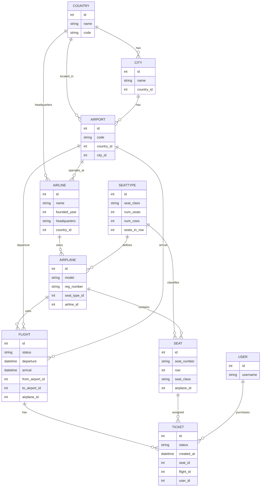

# Airport Project - Models Diagram

## Changes from previous version:
- New `SeatType` model to manage seat configurations
- `Airport` now has direct FK to `Country` (in addition to `City`)
- `Airplane` references `SeatType` instead of having its own seat fields
