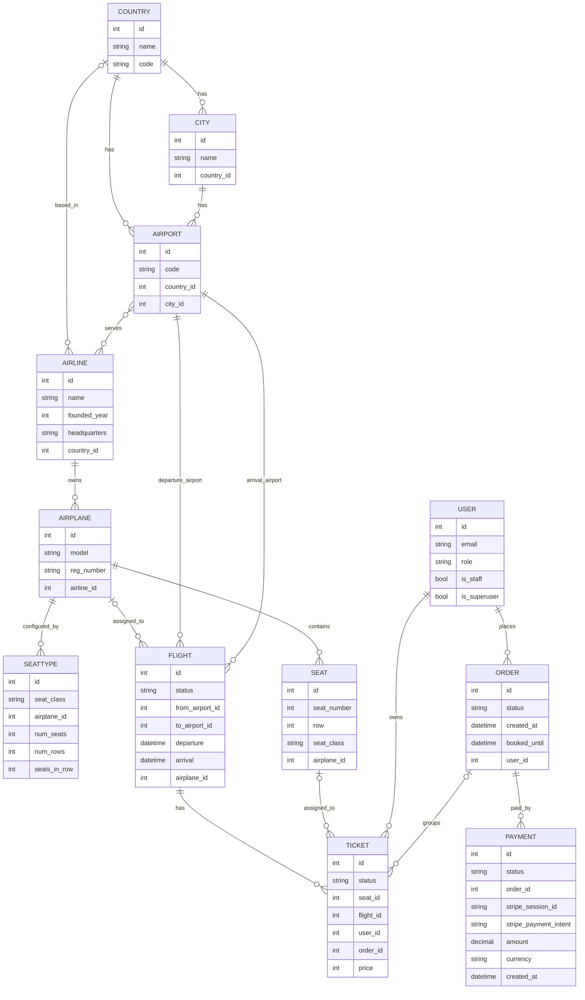

# Airport Project - Models Diagram

## Notes

- `Airline.airport` is a `ManyToManyField`, so the diagram shows `AIRPORT }o--o{ AIRLINE`.
- `SeatType.airplane` is a `ForeignKey`; new `SeatType` records generate `Seat` rows for the linked airplane.
- `Ticket` connects `User`, `Flight`, `Seat`, and optionally `Order`.
- `Payment` belongs to an `Order`; one order can have multiple payment records.
- Nullable relationships are shown with optional cardinality, including `Airline.country`, `Flight.airplane`, `Ticket.seat`, and `Ticket.order`.
