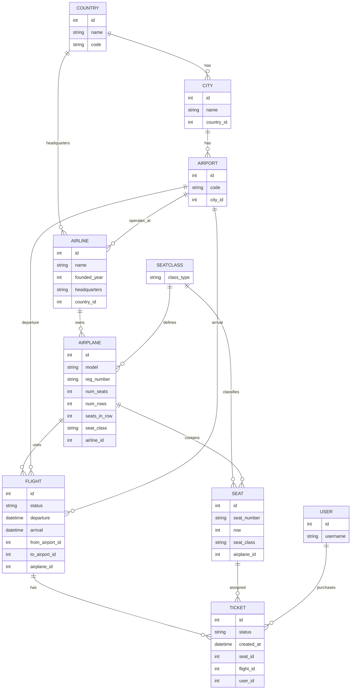

# Airport Project Models

```mermaid
erDiagram
    COUNTRY ||--o{ CITY : "has"
    COUNTRY ||--o{ AIRLINE : "headquarters"
    CITY ||--o{ AIRPORT : "has"
    AIRPORT ||--o{ AIRLINE : "operates_at"
    AIRLINE ||--o{ AIRPLANE : "owns"
    SEATCLASS ||--o{ AIRPLANE : "defines"
    SEATCLASS ||--o{ SEAT : "classifies"
    AIRPLANE ||--o{ SEAT : "contains"
    AIRPLANE ||--o{ FLIGHT : "uses"
    AIRPORT ||--o{ FLIGHT : "departure"
    AIRPORT ||--o{ FLIGHT : "arrival"
    FLIGHT ||--o{ TICKET : "has"
    SEAT ||--o{ TICKET : "assigned"
    USER ||--o{ TICKET : "purchases"

    COUNTRY {
        int id
        string name
        string code
    }
    
    CITY {
        int id
        string name
        int country_id
    }
    
    AIRPORT {
        int id
        string code
        int city_id
    }
    
    AIRLINE {
        int id
        string name
        int founded_year
        string headquarters
        int country_id
    }
    
    SEATCLASS {
        string class_type
    }
    
    AIRPLANE {
        int id
        string model
        string reg_number
        int num_seats
        int num_rows
        int seats_in_row
        string seat_class
        int airline_id
    }
    
    FLIGHT {
        int id
        string status
        datetime departure
        datetime arrival
        int from_airport_id
        int to_airport_id
        int airplane_id
    }
    
    SEAT {
        int id
        string seat_number
        int row
        string seat_class
        int airplane_id
    }
    
    TICKET {
        int id
        string status
        datetime created_at
        int seat_id
        int flight_id
        int user_id
    }
    
    USER {
        int id
        string username
    }
```